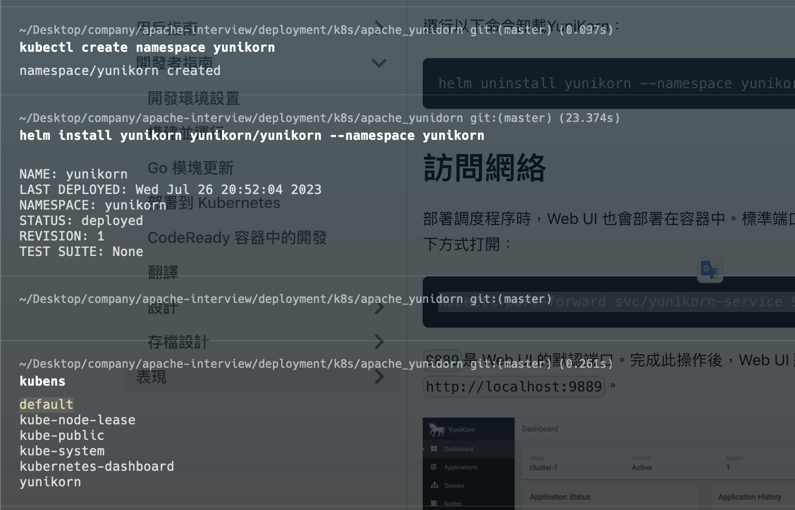
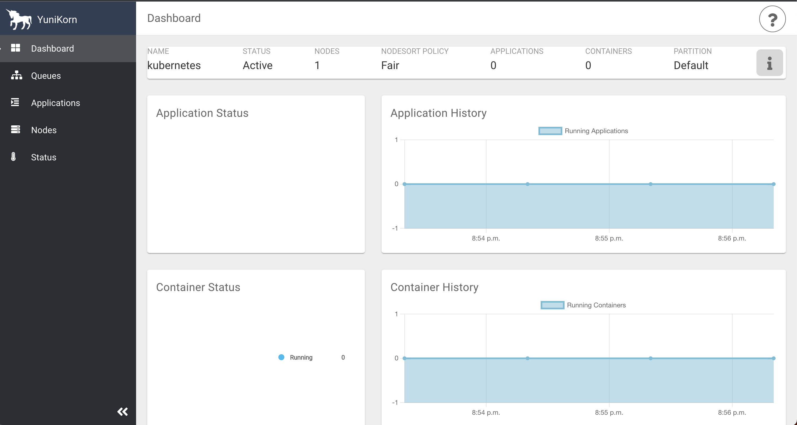

# Get Started
1. Run this shell command in terminal for apache-yunikorn installation. `deployment/k8s/apache_yunikorn/install.sh`
   
2. Port forwarding apache-yunikorn ui on localhost:9889, You can un this shell command in terminal. `deployment/k8s/apache_yunikorn/port_forward_yunikorn_ui.sh`
3. Done! Now you can access the apache-yunikorn ui page on your browser.
   

------
# Minimum Node Spec
* CPU 2 cores.
* Memory 3GB.