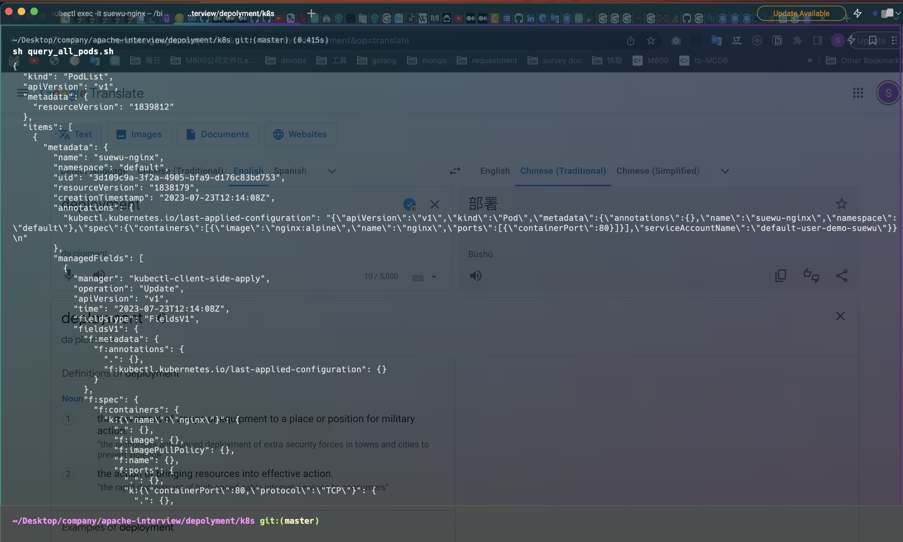

Usage Steps:

1. Open the terminal. Input the command: 
   `{this project path}`
   
2. Input the command:
   `kubectl apply -f deployment/k8s/nginx.yaml`
   
3. Input the command: 
   `sh query_all_pods.sh`
   
4. Done. 

If successful will show such as this screenshot:

